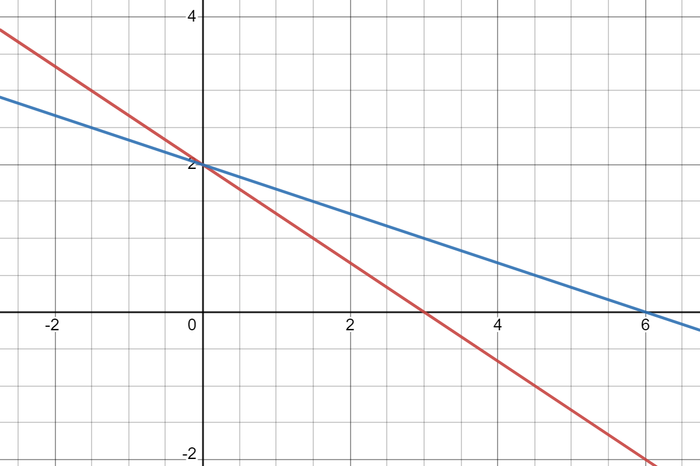
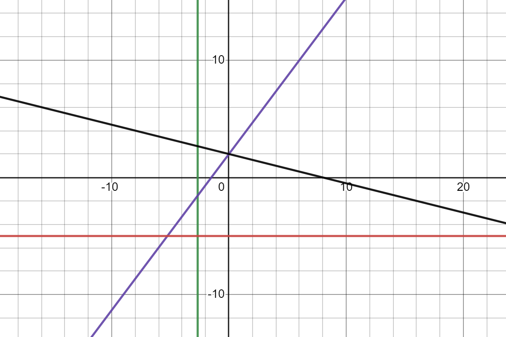
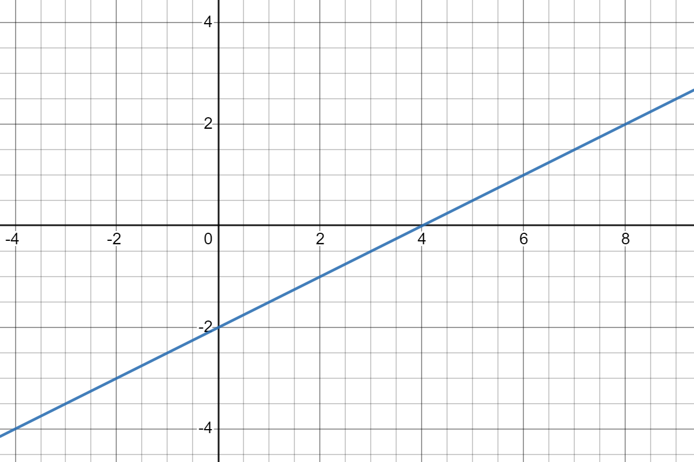
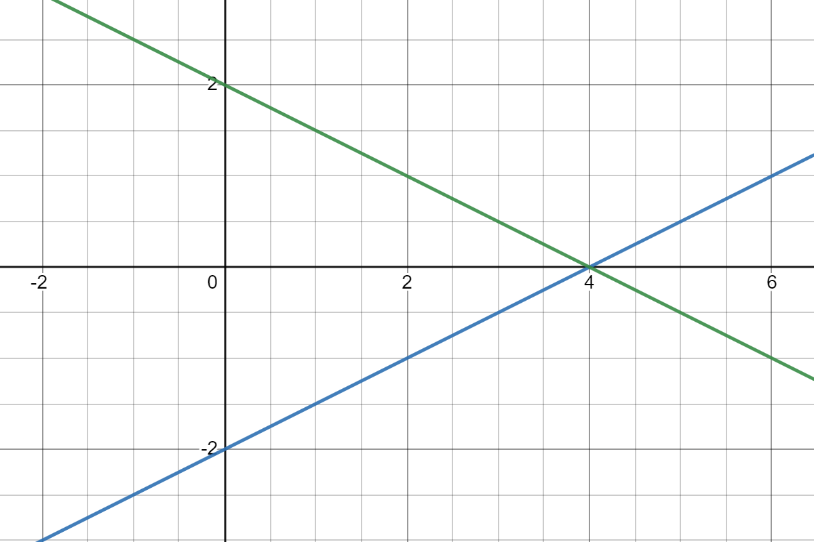
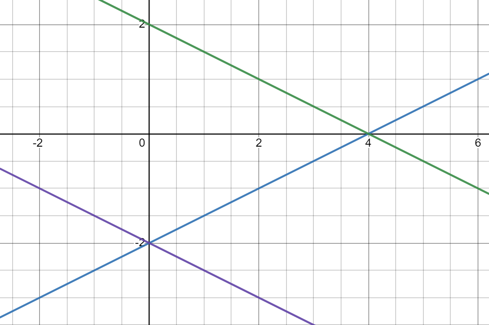
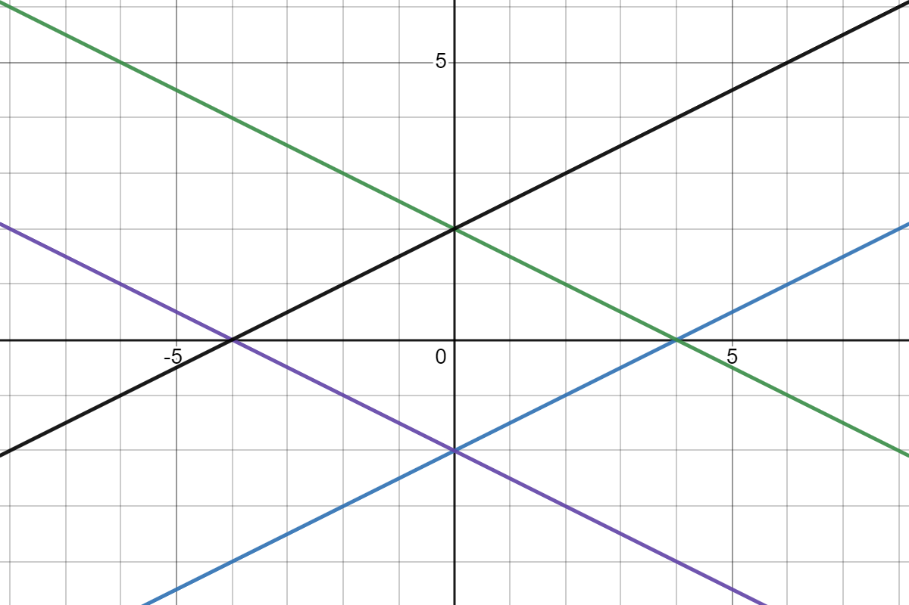

# PRAVAC

## 6.1. Eksplicitni i implicitni oblik jednadžbe pravca

### Pravac - UVOD

U prvom smo razredu razmatrali problem rješavanja linearne jednadžbe s dvjema nepoznanicama oblika Ax + By + C = 0. Ova jednadžba ima beskonačno mnogo rješenja, uređenih parova realnih brojeva (x,y). Sva ta rješenja prikazana u koordinatnom sustavu pripadaju pravcu pa za jednadžbu Ax + By + C = 0 kažemo još i da je jednadžba pravca.

### ⭐ **Pravac**

Pravac je skup točaka ***(x, y)*** u ravnini čije koordinate zadovoljavaju jednadžbu
$$
Ax+By+C = 0
$$
pri čemu je barem jedan od koeficijenata ***A, B*** različit od nule. Ova vrsta se naziva **implicitni oblik jednadžbe pravca**.

Dovoljno je odrediti dvije točke koje leže na tom pravcu, uzimajući po volji vrijednosti za nepoznanicu ***x*** ili za nepoznanicu ***y*** da bi se nacrtao pravac zadan linearnom jednadžbom.

### ✍️ **Primjer 1.**

Nacrtajmo u istom koordinatnom sustavu pravce određene jednadžbama
$$
\text{1) } 2x+y-3=0 \\ \text{2) } x - 3y+6=0
$$
**Rješenje**

**1)**  *x = 0*, dobivamo *y=3*. Za *x=1* dobivamo *y = 1*. Točke *(0,3); (1,1)* leže na pravcu.
**2)**  Stavimo li *y = 2*, dobivamo *x = 0*. Za *y = 3* dobivamo *x = 3*. Pravac prolazi točkama *(0,2); (3,3)*.

### ✅ Zadatak 1.

Nacrtaj pravac čije je jednadžba:
$$
\text{1) }2x+3y-6=0\\ \text{2) }x+3y-6=0
$$

#### Pomoć

Odaberi dvije točke koje pripadaju pravcu te nacrtaj pravac.

#### Rješenje

*Crveni je pravac 1, a plavi pravac 2*.

### Pravci paralelni s koordinatnim osima  

$$
\text{Ako u općoj jednažbi pravaca A = 0, onda ona glasi} \\
\\
Bx+C=0
\\
\\
\text{Tu jednadžbu zadovoljavaju sve točke (x,y) ravnine za koje vrijedi }y=-\frac{C}{B}\text{. Te se točke } \\ \text{nalaze na pravcu koji prolazi točkom } (0, -\frac{C}{B})\text{ i paralelan je osi apcisa. } \\ \text{Ako je u općoj jednadžbi B = 0 onda ona glasi} \\
\\
Ax+C = 0
\\
\\
\text{Tu jednadžbu zadovoljavaju sve točke (x,y) ravnine za koje vrijedi } x=-\frac{C}{A}. \text{ Te se točke nalaze } \\ \text{na pravcu koji prolazi točkom } (-\frac{C}{A},0) \text{ i paralelan je s osi ordinata.}
$$

### ✍️ Primjer 2.

Nacrtajmo u istom koordinatnom sustavu pravce određene jednadžbama:
$$
\text{1) } 2x-3=0 \\
\text{2) } y-3=0
$$

### ✅ Zadatak 2.

Nacrtaj pravce zadane jednadžbama:
$$
\text{1) } 3x+8=0 \\
\text{2) } 4x-3y+6=0 \\
\text{3) } x+4y-8=0 \\
\text{4) } y+5=0
$$
### Pomoć

Odaberi po dvije točke koje pripadaju pravcima te ih nacrtaj. Ima li među zadanim pravcima onih koji su paralelni s nekom od koordinatnih osi? Pogledaj prethodni primjer.

#### Rješenje

*Zeleni prvi, ljubičasti drugi, crni treći i narančasti zadnji*

### Eksplicitni oblik jednadžbe pravca

$$
\text{Ako je } B \ne 0 \text{, jednadžbu } Ax+By+C=0 \\ \text{ dijeljenjem s koeficijentom B prevodimo u jednadžbu oblika} \\
\\
y = -\frac{A}{B}x-\frac{C}{B}
\\
\\ 
\text{Stavimo li } k=-\frac{A}{B}\text{ i } l=-\frac{C}{B} \text{, dobit ćemo jednadžbu pravca u obliku 
y=kx+l.}
$$

Koeficijent smjera ***k*** može biti bilo koji realan broj. Ako je ***k=0***, tad jednadžba pravca glasi ***y=l*** i on je paralelan s osi apscisa.

Stavimo li u eksplicitnu jednadžbu pravca ***x=0*** dobit ćemo ***y=k⋅0+l=l***. To znači da pravac prolazi točkom ***(0,l)***( na osi ordinata. Zato se ***l*** naziva odsječak na osi ordinata. Ako je ***l=0***, pravac prolazi ishodištem.

### ⭐ **Eksplicitni oblik jednadžbe pravca**

Ako pravac nije paralelan s osi ordinata, njegova se jednadžba može napisati u obliku:
$$
y=kx+l
$$
Tu jednadžbu zovemo **eksplicitni oblik** jednadžbe pravca.
Koeficijent ***k*** u eksplicitnoj jednadžbi pravca zovemo **nagib** ili **koeficijent smjera**.
Koeficijent ***l*** nazivamo **odsječak** na osi ordinata.

### ✍️ Primjer 3.

Dan je pravac ***2x−3y+6=0***. Odredi nagib tog pravca i njegov odsječak na osi ***y***.

**Rješenje:**

Jednadžba danog pravca u eksplicitnom obliku glasi
$$
y=\frac{2}{3}x + 2 \\ \\
\text{Odatle odmah čitamo nagib } k=\frac{2}{3}, \text{, a odsječak pravca na osi 
y je l=2.}
$$

### Koeficijent smjera i jednadžbe pravca

Kako glasi jednadžba pravca koji prolazi točkom ***A(x1,y1)*** i ima zadani koeficijent smjera ***k***? Napišimo njegovu eksplicitnu jednadžbu:
$$
y=kx+l
$$
Točka ***A*** leži na pravcu pa njezine koordinate zadovoljavaju tu jednadžbu:
$$
y_1 = kx_1 + l
$$
Oduzimanjem ovih dviju jednadžbi dobivamo:
$$
y-y_1 = k(x - x_1)
$$
i to je tražena jednadžba.

Znamo također da je pravac određen dvjema svojim točkama. Da bismo odredili jednadžbu pravca koji prolazi točkama ***A(x1,y1)*** i ***B(x2,y2)***, možemo iskoristiti jednadžbu jer taj pravac prolazi točkom ***A***. Koeficijent ***k*** odredit ćemo iz uvjeta da i druga točka ***B*** leži na pravcu:
$$
y_2 - y_1 = k(x_2 - x_1) \Rightarrow k = \frac{y_2 - y_1}{x_2 - x_1}
$$

Pogledajmo koje je geometrijsko značenje koeficijenta smjera ***k***. Označimo s φ kut koji pravac zatvara s pozitivnim smjerom osi apscisa. Taj kut uvijek možemo izabrati u granicama 0∘≤φ<180∘. Iz pravokutnog trokuta na slici vidimo da vrijedi
$$
tg\varphi = \frac{y_2 - y_1}{x_2 - x_1}
$$
Prema tome, koeficijent smjera pravca jednak je tangensu priklonog kuta φ.

### ✍️ Primjer 4.

Odredimo nagib pravca koji prolazi točkama ***A*** i ***B***, ako je
$$
\text{1) } A(-1,2), B(3,4) \\
\text{2) } A(-2,3), B(2, -1)
$$
**Rješenje:**
$$
\text{1) Uvrštavanjem koordinata točaka A i B u } k=\frac{y_B - y_A}{x_B -  x_A} \text{ imamo} \\ 
\\
k = \frac{4-2}{3-(-1)} = \frac{2}{4} = \frac{1}{2}
$$
Uočimo da je pravac u prvom primjeru rastući, njegov je nagib pozitivan broj. Drugi je pravac padajući, nagib mu je negativan broj.

$$
\text{U provom primjeru }k=\frac{1}{2}=tg\varphi\text{. Pravac je prema pozitivnom smjeru osi x priklonjen} \\ \text{pod kutom od }26\degree34' \\ 
\text{U drugom primjeru } k = -1 = tg\varphi\text{. Pravac s pozitivnim smjerom osi 
x zatvara kut od 135}\degree.
$$

###  ✅ Zadatak 3.

Koliki kut s pozitivnim smjerom ***osi x*** zatvara pravac koji prolazi točkama ***A(−1,−4)***, ***B(7,2)***?

#### Pomoć

Koja je veza između koeficijenta smjera pravca i kuta kojeg pravac zatvara s pozitivnim dijelom ***osi x***?

#### Rješenje

$$
36\degree52'12''
$$

#### Video kako rješit

### ⭐ Jednadžba pravca

Pravac koji prolazi točkom ***A(x1,y1)*** i ima poznati koeficijent smjera ***k*** ima jednadžbu
$$
y-y_1 = k(x-x_1)
$$
Ako on prolazi i točkom ***B(x2,y2)***, tada koeficijent smjera glasi
$$
k = \frac{y_2 - y_1}{x_2 - x_1}
$$
Jednadžba pravca koji prolazi točkama ***A(x1,y1)***, ***B(x2,y2)*** glasi
$$
y-y_1 = \frac{y_2 - y_1}{x_2 - x_1}(x-x_1)
$$
Za koeficijent smjera vrijedi
$$
k = tg\varphi
$$
gdje je φ kut koji pravac zatvara s pozitivnim dijelom osi apscisa.

### ✍️ Primjer 5.

Odredimo jednadžbu pravca koji os ordinata siječe u točki **B(0,−1)**, a s ***osi x*** zatvara dvostruko veći kut nego pravac ***2x−3y+11=0***.

**Rješenje: **

Pravac siječe ***os y*** u točki B. To znači da je ***l = -1***.

Kako je nagib pravca jednak tangensu kuta što ga pravac zatvara s (pozitivnim smjerom) ***osi x***, onda iz
$$
tg2\varphi = \frac{2tg\varphi}{1-tg^2\varphi} \text{ uvrštavajući }tg\varphi = \frac{2}{3}\text{ dobijemo } tg2\varphi=\frac{12}{5}
$$
Jednadžba traženog pravca glasi:
$$
y=\frac{12}{5}x-1
$$

### ✅ Zadatak 4.

Kako glasi jednadžba pravca koji je simetričan pravcu što prolazi točkama **M(4,0)**, **N(0,−2)** s obzirom na:

**1)** Os apscisa
**2)** Os ordinata 
**3)** Ishodište koordinatnog sustava 

**Jednadžbe pravaca zapiši u implicitnom obliku.**

#### Pomoć

Odredi točke koje su simetrične zadanim s obzirom na os apscisa/os ordinata/ishodište koordinatnog sustava.

#### Rješenje

**1)** Pravac prolazi točkama **(4,0)** i **(0,−2)**, njegova jednadžba je ***x+2y−4=0***.
**2)** Pravac prolazi točkama **(−4,0)** i **(0,−2)**, njegova jednadžba je ***x+2y+4=0***.
**3)** Pravac prolazi točkama **(−4,0)** i **(0,2)**, njegova jednadžba je ***x−2y+4=0***

#### Kako riješiti

Prvo ćemo skicirat točke koje se nam zadane u zadatku i dobiti ovakvi pravac:

**1)** Kako bi smo napravili pravac koji je simetričan s obzirom na *os apscisa* točki N moramo promijeniti predznake čime dobivamo točku **N'(0,2)**, a točka M ostaje ista:

Iz ovoga pak sad možemo jednostavno izračunati *k* pomoću *eksplicitnog oblika* i onda ga pretvoriti u *implicitni koji se traži*, a *l = 2* jer siječe *os y* u toj točki:
$$
l=2 \\
\\
0=4k+2 \text{ uvrstimo ovo iz infomacija koje daje tocka M} \\
-4k = 2 \\
k = -\frac{1}{2} \\
\text{Sad uvrstimo natrag u formulu eksplicitnog } \\
y = -\frac{1}{2}x + 2 \\
\frac{1}{2} + y - 2 = 0 \\
x+2y-4=0
$$
Evo korake ponovimo i za ostale dijelove zadatka samo druge točke:

**2)** *M'(-4,0); N(0, -2)*

$$
l = -2\\
\\
0=-4k-2 \\
k=-\frac{1}{2}\\
y=-\frac{1}{2}x-2\\
\frac{1}{2}+y+2=0\\
x+2y+4=0
$$
**3)** *M'(-4,0); N'(0,2)*

$$
l = 2 \\
0 = -4k + 2 \\
k = \frac{1}{2}
y=\frac{1}{2}x-2 \\
-\frac{1}{2}+y+2=0 \\
x-2y+4=0
$$
